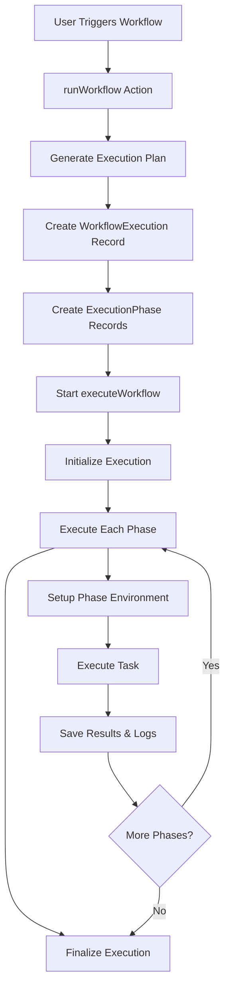

# Workflow Execution Documentation

## Overview

This document explains how the ScrapeFlow workflow execution system works, from creating phases to executing nodes and transferring data between them. The execution system is built around a phase-based architecture where each node becomes a phase that executes sequentially.

## Table of Contents

1. [System Architecture](#system-architecture)
2. [Execution Flow](#execution-flow)
3. [Phase Creation](#phase-creation)
4. [Phase Execution](#phase-execution)
5. [Data Transfer Between Nodes](#data-transfer-between-nodes)
6. [Environment Management](#environment-management)
7. [Logging System](#logging-system)
8. [Complete Example](#complete-example)

---

## System Architecture

### Key Components

```
┌─────────────────┐    ┌─────────────────┐    ┌─────────────────┐
│   runWorkflow   │───▶│ executeWorkflow │───▶│  Task Executors │
│  (Entry Point)  │    │   (Main Loop)   │    │ (Actual Tasks)  │
└─────────────────┘    └─────────────────┘    └─────────────────┘
         │                       │                       │
         ▼                       ▼                       ▼
┌─────────────────┐    ┌─────────────────┐    ┌─────────────────┐
│ ExecutionPlan   │    │   Environment   │    │ ExecutionEnv    │
│   Generation    │    │   Management    │    │    (Bridge)     │
└─────────────────┘    └─────────────────┘    └─────────────────┘
```

### File References

- **Entry Point**: [`actions/workflows/runWorkflow.ts`](actions/workflows/runWorkflow.ts)
- **Main Execution**: [`lib/workflow/executeWorkflow.ts`](lib/workflow/executeWorkflow.ts)
- **Execution Planning**: [`lib/workflow/executionPlan.ts`](lib/workflow/executionPlan.ts)
- **Task Registry**: [`lib/workflow/task/registry.tsx`](lib/workflow/task/registry.tsx)
- **Executor Registry**: [`lib/workflow/executor/registry.ts`](lib/workflow/executor/registry.ts)
- **Type Definitions**: [`types/executor.ts`](types/executor.ts), [`types/workflow.ts`](types/workflow.ts)

---

## Execution Flow

### High-Level Process



---

## Phase Creation

### Step 1: Execution Plan Generation

**File**: [`lib/workflow/executionPlan.ts`](lib/workflow/executionPlan.ts)

The execution plan determines the order in which nodes will execute:

```typescript
// Input: Flow definition with nodes and edges
const flow = {
  nodes: [
    {
      id: "node_1",
      data: {
        type: "LAUNCH_BROWSER",
        inputs: { websiteUrl: "https://example.com" },
      },
    },
    {
      id: "node_2",
      data: { type: "EXTRACT_TEXT", inputs: { selector: "h1" } },
    },
    { id: "node_3", data: { type: "CLOSE_BROWSER", inputs: {} } },
  ],
  edges: [
    {
      source: "node_1",
      target: "node_2",
      sourceHandle: "webPage",
      targetHandle: "webPage",
    },
    {
      source: "node_2",
      target: "node_3",
      sourceHandle: "webPage",
      targetHandle: "webPage",
    },
  ],
};

// Output: Execution plan with phases
const executionPlan = [
  { phase: 1, nodes: [node_1] }, // Entry point
  { phase: 2, nodes: [node_2] }, // Depends on node_1
  { phase: 3, nodes: [node_3] }, // Depends on node_2
];
```

### Step 2: Database Phase Creation

**File**: [`actions/workflows/runWorkflow.ts`](actions/workflows/runWorkflow.ts)

```typescript
// Create ExecutionPhase records for each node
const execution = await prisma.workflowExecution.create({
  data: {
    workflowId,
    userId,
    status: WorkflowExecutionStatus.PENDING,
    definition: flowDefinition,
    phases: {
      create: executionPlan.flatMap((phase) => {
        return phase.nodes.flatMap((node) => {
          return {
            userId,
            status: ExecutionPhaseStatus.CREATED, // Initial status
            number: phase.phase,
            node: JSON.stringify(node), // Store entire node as JSON
            name: TaskRegistry[node.data.type].label,
          };
        });
      }),
    },
  },
});
```

**Database State After Creation**:

```sql
-- WorkflowExecution
INSERT INTO WorkflowExecution (id, status, definition) VALUES
('exec_123', 'PENDING', '{"nodes":[...], "edges":[...]}');

-- ExecutionPhase records
INSERT INTO ExecutionPhase (id, number, name, node, status) VALUES
('phase_1', 1, 'Launch Browser', '{"id":"node_1",...}', 'CREATED'),
('phase_2', 2, 'Extract Text', '{"id":"node_2",...}', 'CREATED'),
('phase_3', 3, 'Close Browser', '{"id":"node_3",...}', 'CREATED');
```

---

## Phase Execution

### Step 1: Environment Initialization

**File**: [`lib/workflow/executeWorkflow.ts`](lib/workflow/executeWorkflow.ts)

```typescript
// Environment structure
const environment: Environment = {
  phases: {}, // Will store inputs/outputs for each node
  browser: undefined, // Shared browser instance
  page: undefined, // Shared page instance
};

// Initialize all phases to PENDING
await prisma.executionPhase.updateMany({
  where: { id: { in: execution.phases.map((p) => p.id) } },
  data: { status: ExecutionPhaseStatus.PENDING },
});
```

### Step 2: Individual Phase Execution

```typescript
async function executeWorkflowPhase(phase, environment, edges) {
  // 1. Create log collector
  const logCollector = createLogCollector();

  // 2. Parse node from stored JSON
  const node = JSON.parse(phase.node) as AppNode;

  // 3. Setup environment for this phase
  setupEnvironmentForPhase(node, environment, edges);

  // 4. Mark phase as RUNNING
  await prisma.executionPhase.update({
    where: { id: phase.id },
    data: {
      status: ExecutionPhaseStatus.RUNNING,
      startedAt: new Date(),
      inputs: JSON.stringify(environment.phases[node.id].inputs),
    },
  });

  // 5. Execute the task
  const success = await executePhase(phase, node, environment, logCollector);

  // 6. Save results
  await finalizePhase(phase.id, success, outputs, logCollector);

  return { success };
}
```

### Step 3: Task Execution

```typescript
async function executePhase(phase, node, environment, logCollector) {
  // Get the executor function for this task type
  const runFn = ExecutorRegistry[node.data.type];

  // Create execution environment (bridge between system and task)
  const executionEnvironment = createExecutionEnvironment(
    node,
    environment,
    logCollector
  );

  // Execute the actual task
  return await runFn(executionEnvironment);
}
```

---

## Data Transfer Between Nodes

### Environment Setup Process

**File**: [`lib/workflow/executeWorkflow.ts`](lib/workflow/executeWorkflow.ts) - `setupEnvironmentForPhase`

```typescript
function setupEnvironmentForPhase(
  node: AppNode,
  environment: Environment,
  edges: Edge[]
) {
  // Initialize this node's environment
  environment.phases[node.id] = { inputs: {}, outputs: {} };

  // Get task definition
  const inputs = TaskRegistry[node.data.type].inputs;

  for (const input of inputs) {
    // Skip browser instances (handled separately)
    if (input.type === TaskParamType.BROWSER_INSTANCE) continue;

    // 1. Check if input has a direct value
    const inputValue = node.data.inputs[input.name];
    if (inputValue) {
      environment.phases[node.id].inputs[input.name] = inputValue;
      continue;
    }

    // 2. Get input from connected node's output
    const connectedEdge = edges.find(
      (edge) => edge.target === node.id && edge.targetHandle === input.name
    );

    if (connectedEdge) {
      const outputValue =
        environment.phases[connectedEdge.source].outputs[
          connectedEdge.sourceHandle
        ];
      environment.phases[node.id].inputs[input.name] = outputValue;
    }
  }
}
```

### Data Transfer Example

**Scenario**: Launch Browser → Extract Text → Close Browser

```typescript
// Phase 1: Launch Browser Execution
// BEFORE execution
environment = {
  phases: {
    "node_1": { inputs: { websiteUrl: "https://example.com" }, outputs: {} }
  },
  browser: undefined,
  page: undefined
}

// DURING LaunchBrowserExecutor execution
const browser = await puppeteer.launch();
environment.setBrowser(browser); // Sets environment.browser
const page = await browser.newPage();
environment.setPage(page); // Sets environment.page
environment.setOutput("webPage", "browser_ready"); // Sets output

// AFTER execution
environment = {
  phases: {
    "node_1": {
      inputs: { websiteUrl: "https://example.com" },
      outputs: { webPage: "browser_ready" }
    }
  },
  browser: <Browser Instance>,
  page: <Page Instance>
}

// Phase 2: Extract Text Setup
// setupEnvironmentForPhase finds the edge connection:
const edge = { source: "node_1", target: "node_2", sourceHandle: "webPage", targetHandle: "webPage" }

// Sets up inputs from previous phase output
environment.phases["node_2"] = {
  inputs: {
    webPage: "browser_ready", // From node_1 output
    selector: "h1" // From node configuration
  },
  outputs: {}
}
```

---

## Environment Management

### ExecutionEnvironment Bridge

**File**: [`lib/workflow/executeWorkflow.ts`](lib/workflow/executeWorkflow.ts) - `createExecutionEnvironment`

The ExecutionEnvironment acts as a bridge between the execution system and individual task executors:

```typescript
function createExecutionEnvironment(
  node,
  environment,
  logCollector
): ExecutionEnvironment {
  return {
    // Node-specific input access
    getInput: (name: string) => environment.phases[node.id]?.inputs[name],

    // Node-specific output setting
    setOutput: (name: string, value: string) => {
      environment.phases[node.id].outputs[name] = value;
    },

    // Shared browser management
    getBrowser: () => environment.browser,
    setBrowser: (browser: Browser) => (environment.browser = browser),

    // Shared page management
    getPage: () => environment.page,
    setPage: (page: Page) => (environment.page = page),

    // Logging
    log: logCollector,
  };
}
```

### Type Safety

**File**: [`types/executor.ts`](types/executor.ts)

```typescript
export type Environment = {
  browser?: Browser;
  page?: Page;
  phases: Record<
    string,
    {
      inputs: Record<string, string>;
      outputs: Record<string, string>;
    }
  >;
};

export type ExecutionEnvironment<T extends WorkflowTask> = {
  getInput(name: T["inputs"][number]["name"]): string;
  setOutput(name: T["outputs"][number]["name"], value: string): void;
  getBrowser(): Browser | undefined;
  setBrowser(browser: Browser): void;
  getPage(): Page | undefined;
  setPage(page: Page): void;
  log: LogCollector;
};
```

---

## Logging System

### Log Creation Process

**File**: [`lib/log.ts`](lib/log.ts)

```typescript
export function createLogCollector(): LogCollector {
  const logs: Log[] = [];

  const logFunctions = {} as Record<LogLevel, LogFunction>;

  LogLevels.forEach(
    (level) =>
      (logFunctions[level] = (message: string) => {
        logs.push({ message, level, timestamp: new Date() });
      })
  );

  return {
    getAll: () => logs,
    ...logFunctions,
  };
}
```

### Log Usage in Executors

```typescript
// Example from LaunchBrowserExecutor
export async function LaunchBrowserExecutor(environment) {
  try {
    environment.log.info("Starting browser launch process");

    const websiteUrl = environment.getInput("Website url");
    environment.log.info(`Launching browser for URL: ${websiteUrl}`);

    const browser = await puppeteer.launch({ headless: false });
    environment.setBrowser(browser);

    environment.log.info("Browser launched successfully");
    return true;
  } catch (error) {
    environment.log.error(`Failed to launch browser: ${error.message}`);
    return false;
  }
}
```

### Log Storage

**File**: [`lib/workflow/executeWorkflow.ts`](lib/workflow/executeWorkflow.ts) - `finalizePhase`

```typescript
async function finalizePhase(phaseId, success, outputs, logCollector) {
  await prisma.executionPhase.update({
    where: { id: phaseId },
    data: {
      status: success
        ? ExecutionPhaseStatus.COMPLETED
        : ExecutionPhaseStatus.FAILED,
      completedAt: new Date(),
      outputs: JSON.stringify(outputs),
      logs: {
        createMany: {
          data: logCollector.getAll().map((log) => ({
            message: log.message,
            timestamp: log.timestamp,
            logLevel: log.level,
          })),
        },
      },
    },
  });
}
```

---

## Complete Example

### Workflow: Launch Browser → Extract Text → Close Browser

#### 1. Initial Setup

```javascript
// Flow definition
const flowDefinition = {
  nodes: [
    {
      id: "launch_1",
      data: {
        type: "LAUNCH_BROWSER",
        inputs: { websiteUrl: "https://example.com" },
      },
    },
    {
      id: "extract_1",
      data: {
        type: "EXTRACT_TEXT_FROM_ELEMENT",
        inputs: { selector: "h1" },
      },
    },
    {
      id: "close_1",
      data: {
        type: "CLOSE_BROWSER",
        inputs: {},
      },
    },
  ],
  edges: [
    {
      source: "launch_1",
      target: "extract_1",
      sourceHandle: "webPage",
      targetHandle: "webPage",
    },
    {
      source: "extract_1",
      target: "close_1",
      sourceHandle: "webPage",
      targetHandle: "webPage",
    },
  ],
};
```

#### 2. Execution Plan Generation

```javascript
// Generated execution plan
const executionPlan = [
  { phase: 1, nodes: [launch_1] },
  { phase: 2, nodes: [extract_1] },
  { phase: 3, nodes: [close_1] },
];
```

#### 3. Phase-by-Phase Execution

**Phase 1: Launch Browser**

```javascript
// Environment before
environment = {
  phases: {},
  browser: undefined,
  page: undefined
}

// Setup phase environment
environment.phases["launch_1"] = {
  inputs: { websiteUrl: "https://example.com" },
  outputs: {}
}

// Execute LaunchBrowserExecutor
const browser = await puppeteer.launch();
environment.setBrowser(browser);
const page = await browser.newPage();
await page.goto("https://example.com");
environment.setPage(page);
environment.setOutput("webPage", "browser_instance");

// Environment after
environment = {
  phases: {
    "launch_1": {
      inputs: { websiteUrl: "https://example.com" },
      outputs: { webPage: "browser_instance" }
    }
  },
  browser: <Browser>,
  page: <Page>
}

// Database update
UPDATE ExecutionPhase SET
  status = 'COMPLETED',
  outputs = '{"webPage":"browser_instance"}',
  completedAt = NOW()
WHERE id = 'phase_launch_1';

// Logs saved
INSERT INTO ExecutionLog VALUES
('log_1', 'Starting browser launch process', 'info', NOW()),
('log_2', 'Launching browser for URL: https://example.com', 'info', NOW()),
('log_3', 'Browser launched successfully', 'info', NOW());
```

**Phase 2: Extract Text**

```javascript
// Setup phase environment (connects to previous phase)
const connectedEdge = edges.find(e => e.target === "extract_1" && e.targetHandle === "webPage");
// Edge: { source: "launch_1", sourceHandle: "webPage", target: "extract_1", targetHandle: "webPage" }

environment.phases["extract_1"] = {
  inputs: {
    webPage: environment.phases["launch_1"].outputs["webPage"], // "browser_instance"
    selector: "h1" // From node configuration
  },
  outputs: {}
}

// Execute ExtractTextExecutor
const page = environment.getPage(); // Gets shared page instance
const extractedText = await page.$eval("h1", el => el.textContent);
environment.setOutput("extractedText", extractedText);
environment.setOutput("webPage", "browser_instance"); // Pass through

// Environment after
environment = {
  phases: {
    "launch_1": { inputs: {...}, outputs: { webPage: "browser_instance" } },
    "extract_1": {
      inputs: { webPage: "browser_instance", selector: "h1" },
      outputs: { extractedText: "Welcome to Example", webPage: "browser_instance" }
    }
  },
  browser: <Browser>,
  page: <Page>
}
```

**Phase 3: Close Browser**

```javascript
// Setup phase environment
environment.phases["close_1"] = {
  inputs: {
    webPage: environment.phases["extract_1"].outputs["webPage"] // "browser_instance"
  },
  outputs: {}
}

// Execute CloseBrowserExecutor
const browser = environment.getBrowser();
await browser.close();
environment.setBrowser(null);
environment.setPage(null);
environment.setOutput("closureStatus", "success");

// Final environment
environment = {
  phases: {
    "launch_1": { inputs: {...}, outputs: {...} },
    "extract_1": { inputs: {...}, outputs: {...} },
    "close_1": {
      inputs: { webPage: "browser_instance" },
      outputs: { closureStatus: "success" }
    }
  },
  browser: null,
  page: null
}
```

#### 4. Final Database State

```sql
-- WorkflowExecution
UPDATE WorkflowExecution SET
  status = 'COMPLETED',
  completedAt = NOW()
WHERE id = 'exec_123';

-- ExecutionPhases
UPDATE ExecutionPhase SET status = 'COMPLETED' WHERE workflowExecutionId = 'exec_123';

-- ExecutionLogs (multiple entries for each phase)
SELECT * FROM ExecutionLog WHERE phaseId IN (
  SELECT id FROM ExecutionPhase WHERE workflowExecutionId = 'exec_123'
);
-- Returns all logs from all phases with timestamps and levels
```

---

## Key Takeaways

1. **Phase-Based Execution**: Each node becomes a phase that executes sequentially
2. **Environment Continuity**: Browser and page instances are shared across phases
3. **Data Flow**: Outputs from one phase become inputs to connected phases via edges
4. **Type Safety**: ExecutionEnvironment provides type-safe access to inputs/outputs
5. **Comprehensive Logging**: Every action is logged and stored for debugging
6. **Database Persistence**: All state changes are persisted for monitoring and recovery
7. **Error Handling**: Failed phases stop execution and are properly logged

This architecture provides a robust, observable, and maintainable workflow execution system that can handle complex automation scenarios while maintaining data integrity and providing detailed execution insights.
