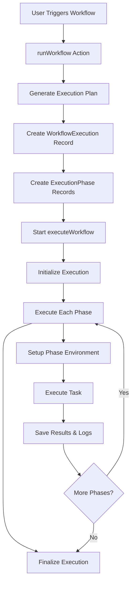
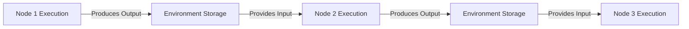

# Workflow Execution Documentation

## Overview

This document explains how the ScrapeFlow workflow execution system works, from creating phases to executing nodes and transferring data between them. The execution system is built around a phase-based architecture where each node becomes a phase that executes sequentially.

## Table of Contents

1. [System Architecture](#system-architecture)
2. [Execution Flow](#execution-flow)
3. [Phase Creation](#phase-creation)
4. [Phase Execution](#phase-execution)
5. [Data Transfer Between Nodes](#data-transfer-between-nodes)
6. [Environment Management](#environment-management)
7. [Logging System](#logging-system)
8. [Complete Example](#complete-example)

---

## System Architecture

### Key Components

```
┌─────────────────┐    ┌─────────────────┐    ┌─────────────────┐
│   runWorkflow   │───▶│ executeWorkflow │───▶│  Task Executors │
│  (Entry Point)  │    │   (Main Loop)   │    │ (Actual Tasks)  │
└─────────────────┘    └─────────────────┘    └─────────────────┘
         │                       │                       │
         ▼                       ▼                       ▼
┌─────────────────┐    ┌─────────────────┐    ┌─────────────────┐
│ ExecutionPlan   │    │   Environment   │    │ ExecutionEnv    │
│   Generation    │    │   Management    │    │    (Bridge)     │
└─────────────────┘    └─────────────────┘    └─────────────────┘
```

### Workflow Definition Source

The workflow definition originates from the React Flow editor in the UI and follows this path:

1. **UI Capture**: When a user triggers workflow execution via the Execute button in `ExecuteBtn.tsx`, the current state of the flow editor is captured:

```typescript
// app/workflow/_components/topbar/ExecuteBtn.tsx
mutation.mutate({
  workflowId: workflowId,
  flowDefinition: JSON.stringify(toObject()),
});
```

The `toObject()` method from the `useReactFlow()` hook converts the entire React Flow editor state (nodes and edges) to a JavaScript object, which is then serialized to JSON.

2. **Server Processing**: The workflow definition is sent to the server action in `runWorkflow.ts`:

```typescript
// actions/workflows/runWorkflow.ts
const flow = JSON.parse(flowDefinition);
const result = FlowToExecutionPlan(flow.nodes, flow.edges);
```

3. **Storage**: The original workflow definition is stored in the database as part of the workflow execution record:

```typescript
// actions/workflows/runWorkflow.ts
const execution = await prisma.workflowExecution.create({
  data: {
    // ...other fields
    definition: flowDefinition,
    // ...other fields
  },
});
```

### Workflow Definition Structure

The workflow definition contains the complete state of the React Flow editor including:

```typescript
{
  nodes: [
    {
      id: "node_1",
      type: "appNode",
      position: { x: 100, y: 200 },
      data: {
        type: "LAUNCH_BROWSER",
        inputs: {
          websiteUrl: "https://example.com",
          headless: "true"
        },
        outputs: {}
      }
    },
    // ... more nodes
  ],
  edges: [
    {
      id: "edge_1-2",
      source: "node_1",
      sourceHandle: "browser",
      target: "node_2",
      targetHandle: "browser"
    },
    {
      id: "edge_2-3",
      source: "node_2",
      sourceHandle: "extractedText",
      target: "node_3",
      targetHandle: null
    }
    // ... more edges
  ],
  viewport: {
    x: 0,
    y: 0,
    zoom: 1
  }
}
```

### File References

- **Entry Point**: [`actions/workflows/runWorkflow.ts`](actions/workflows/runWorkflow.ts)
- **Main Execution**: [`lib/workflow/executeWorkflow.ts`](lib/workflow/executeWorkflow.ts)
- **Execution Planning**: [`lib/workflow/executionPlan.ts`](lib/workflow/executionPlan.ts)
- **Task Registry**: [`lib/workflow/task/registry.tsx`](lib/workflow/task/registry.tsx)
- **Executor Registry**: [`lib/workflow/executor/registry.ts`](lib/workflow/executor/registry.ts)
- **Type Definitions**: [`types/executor.ts`](types/executor.ts), [`types/workflow.ts`](types/workflow.ts)

---

## Execution Flow

### High-Level Process



### From Flow Definition to Execution Plan

The transformation from a visual workflow to an executable plan involves several steps:

1. **User Interaction**: User builds a workflow in the React Flow editor and clicks "Execute"
2. **Data Capture**: The complete flow definition is serialized from the editor state
3. **Execution Planning**: The `FlowToExecutionPlan` function analyzes node dependencies and creates phases
4. **Database Creation**: Execution and phase records are created in the database
5. **Execution**: The workflow execution begins processing phases in order

This process ensures that nodes execute in the correct order based on their dependencies, with each phase containing nodes that can execute in parallel.

---

## Phase Creation

### Step 1: Execution Plan Generation

**File**: [`lib/workflow/executionPlan.ts`](lib/workflow/executionPlan.ts)

The execution plan determines the order in which nodes will execute by organizing them into phases.

#### How Execution Plan Generation Works

The `FlowToExecutionPlan` function is responsible for analyzing the workflow's nodes and edges to create a structured execution plan:

```typescript
export function FlowToExecutionPlan(
  nodes: AppNode[],
  edges: Edge[]
): FlowToExecutionPlanType {
  // Find the entry point node (e.g., LAUNCH_BROWSER)
  const entryPoint = nodes.find(
    (node) => TaskRegistry[node.data.type].isEntryPoint
  );

  // Validation and error handling...

  // Create the first phase with the entry point
  const executionPlan: WorkflowExecutionPlan = [
    {
      phase: 1,
      nodes: [entryPoint],
    },
  ];

  // Track nodes that have been added to the plan
  const planned = new Set<string>();
  planned.add(entryPoint.id);

  // Create subsequent phases based on dependencies
  for (
    let phase = 2;
    phase <= nodes.length && planned.size < nodes.length;
    phase++
  ) {
    // For each phase, find nodes whose dependencies are met
    // ...
  }

  // Return the completed execution plan
  return { executionPlan };
}
```

The function performs the following key operations:

1. **Entry Point Identification**: Finds the starting node (typically a LAUNCH_BROWSER node)
2. **Dependency Analysis**: Analyzes which nodes depend on outputs from other nodes
3. **Phase Organization**: Groups nodes that can run in parallel into phases
4. **Validation**: Ensures all required inputs are provided either directly or via connections

#### Example Input and Output

**Input**: Flow definition with nodes and edges

```typescript
// Input: Flow definition with nodes and edges
const flow = {
  nodes: [
    {
      id: "node_1",
      data: {
        type: "LAUNCH_BROWSER",
        inputs: { websiteUrl: "https://example.com" },
      },
    },
    {
      id: "node_2",
      data: { type: "EXTRACT_TEXT", inputs: { selector: "h1" } },
    },
    { id: "node_3", data: { type: "CLOSE_BROWSER", inputs: {} } },
  ],
  edges: [
    {
      source: "node_1",
      target: "node_2",
      sourceHandle: "webPage",
      targetHandle: "webPage",
    },
    {
      source: "node_2",
      target: "node_3",
      sourceHandle: "webPage",
      targetHandle: "webPage",
    },
  ],
};

// Output: Execution plan with phases
const executionPlan = [
  { phase: 1, nodes: [node_1] }, // Entry point
  { phase: 2, nodes: [node_2] }, // Depends on node_1
  { phase: 3, nodes: [node_3] }, // Depends on node_2
];
```

**Output**: Structured execution plan

```typescript
const executionPlan = [
  {
    phase: 1,
    nodes: [
      {
        id: "node_1",
        data: {
          type: "LAUNCH_BROWSER",
          inputs: { websiteUrl: "https://example.com" },
        },
      },
    ],
  },
  {
    phase: 2,
    nodes: [
      {
        id: "node_2",
        data: { type: "EXTRACT_TEXT", inputs: { selector: "h1" } },
      },
    ],
  },
  {
    phase: 3,
    nodes: [
      {
        id: "node_3",
        data: { type: "CLOSE_BROWSER", inputs: {} },
      },
    ],
  },
];
```

### Purpose of Execution Planning

The creation of an execution plan is a critical step that serves several important purposes:

1. **Dependency Resolution**:
   The execution plan analyzes which nodes depend on outputs from other nodes. This ensures operations happen in the correct order - you can't extract text from a webpage before launching a browser.

2. **Phase Organization**:
   Nodes are organized into ordered phases where each phase contains nodes that can execute in parallel. This optimizes execution while maintaining dependency constraints.

3. **Input Validation**:
   During plan creation, the system validates that all required inputs for each node are available - either directly provided by the user or through connections from other nodes. This prevents runtime errors due to missing inputs.

4. **Execution Order Determination**:
   The visual flow in the React Flow editor doesn't inherently contain execution order information - it's just a collection of connected nodes. The execution plan converts this into a deterministic sequence with clear ordering.

5. **Database Representation**:
   The plan is used to create database records that track execution status, enabling progress monitoring, retry capabilities, and execution history.

Without this planning step, the system wouldn't know which order to run nodes in, couldn't validate if all required data would be available, and couldn't organize execution efficiently. The execution plan is the bridge between the user's visual workflow design and a concrete, executable process.

#### Execution Plan vs. Flow Definition

While the **Flow Definition** represents the visual workflow as designed in the editor (including positions, visual elements, and connections), the **Execution Plan** is a structured, dependency-ordered representation focused on execution order and node relationships:

| Flow Definition                               | Execution Plan                        |
| --------------------------------------------- | ------------------------------------- |
| Complete UI state                             | Execution-focused structure           |
| Contains visual metadata (positions, styling) | Contains only execution-relevant data |
| Unordered nodes                               | Nodes organized into ordered phases   |
| Contains all connections                      | Dependencies analyzed and validated   |

### Step 2: Database Record Creation

**File**: [`actions/workflows/runWorkflow.ts`](actions/workflows/runWorkflow.ts)

The execution plan is used to create database records for each phase:

```typescript
const execution = await prisma.workflowExecution.create({
  data: {
    workflowId,
    userId,
    status: WorkflowExecutionStatus.PENDING,
    startedAt: new Date(),
    trigger: WorkflowExectutionTrigger.MANUAL,
    definition: flowDefinition, // Original flow definition stored here
    phases: {
      create: executionPlan.flatMap((phase) => {
        return phase.nodes.flatMap((node) => {
          return {
            userId,
            status: ExecutionPhaseStatus.CREATED,
            number: phase.phase,
            node: JSON.stringify(node), // Each node stored in phase record
            name: TaskRegistry[node.data.type].label,
          };
        });
      }),
    },
  },
});
```

### Step 3: Execution Initialization

**File**: [`lib/workflow/executeWorkflow.ts`](lib/workflow/executeWorkflow.ts)

After the execution plan is created and stored, the execution process begins:

```typescript
export async function ExecuteWorkflow(executionId: string) {
  // Phase retrieval and execution process
  // ...
}
```

---

## Phase Execution

### Step 1: Environment Initialization

**File**: [`lib/workflow/executeWorkflow.ts`](lib/workflow/executeWorkflow.ts)

```typescript
// Environment structure
const environment: Environment = {
  phases: {}, // Will store inputs/outputs for each node
  browser: undefined, // Shared browser instance
  page: undefined, // Shared page instance
};

// Initialize all phases to PENDING
await prisma.executionPhase.updateMany({
  where: { id: { in: execution.phases.map((p) => p.id) } },
  data: { status: ExecutionPhaseStatus.PENDING },
});
```

### Step 2: Individual Phase Execution

```typescript
async function executeWorkflowPhase(phase, environment, edges) {
  // 1. Create log collector
  const logCollector = createLogCollector();

  // 2. Parse node from stored JSON
  const node = JSON.parse(phase.node) as AppNode;

  // 3. Setup environment for this phase
  setupEnvironmentForPhase(node, environment, edges);

  // 4. Mark phase as RUNNING
  await prisma.executionPhase.update({
    where: { id: phase.id },
    data: {
      status: ExecutionPhaseStatus.RUNNING,
      startedAt: new Date(),
      inputs: JSON.stringify(environment.phases[node.id].inputs),
    },
  });

  // 5. Execute the task
  const success = await executePhase(phase, node, environment, logCollector);

  // 6. Save results
  await finalizePhase(phase.id, success, outputs, logCollector);

  return { success };
}
```

### Step 3: Task Execution

```typescript
async function executePhase(phase, node, environment, logCollector) {
  // Get the executor function for this task type
  const runFn = ExecutorRegistry[node.data.type];

  // Create execution environment (bridge between system and task)
  const executionEnvironment = createExecutionEnvironment(
    node,
    environment,
    logCollector
  );

  // Execute the actual task
  return await runFn(executionEnvironment);
}
```

---

## Data Transfer Between Nodes

### How Data Flows Through the Workflow

Data flows through the workflow in a structured manner, following the connections defined in the editor:

1. **Node Output Generation**: Each node executor can produce outputs using `environment.setOutput()`
2. **Edge Connections**: Edges in the workflow connect source outputs to target inputs
3. **Environment Management**: The execution environment manages access to outputs from previous nodes
4. **Input Resolution**: When a node runs, its inputs are resolved from direct values or connected outputs



### Data Flow Example

```typescript
// Step 1: LAUNCH_BROWSER produces a browser object
environment.setOutput("browser", browserInstance);

// Step 2: When EXTRACT_TEXT executes, it receives the browser from Node 1
const browser = environment.getInput("browser");
// ...extraction logic...
environment.setOutput("extractedText", extractedText);

// Step 3: When SAVE_TO_FILE executes, it receives the extracted text
const textToSave = environment.getInput("text");
// ...file saving logic...
```

### Execution Environment Interface

The execution environment provides methods to access inputs and set outputs:

```typescript
interface ExecutionEnvironment {
  // Access inputs (from direct values or connected outputs)
  getInput: (name: string) => any;

  // Set outputs for downstream nodes
  setOutput: (name: string, value: any) => void;

  // Get all available outputs from previous nodes
  getAllOutputs: () => Record<string, any>;

  // Logging capabilities
  log: LogCollector;

  // Browser management (specific to web automation)
  getBrowser: () => Browser | null;
  setBrowser: (browser: Browser) => void;
}
```

### Connecting Flow Definition to Data Transfer

The edges defined in the React Flow editor directly control how data flows between nodes:

```typescript
// From the flow definition
{
  edges: [
    {
      source: "node_1", // Source node ID
      sourceHandle: "browser", // Output name from source node
      target: "node_2", // Target node ID
      targetHandle: "browser", // Input name on target node
    },
  ];
}
```

This edge definition means:

- The output named "browser" from node_1
- Will be provided as the input named "browser" to node_2

The execution environment handles resolving these connections at runtime, making the appropriate values available to each node as it executes.

---

## Environment Management

### ExecutionEnvironment Bridge

**File**: [`lib/workflow/executeWorkflow.ts`](lib/workflow/executeWorkflow.ts) - `createExecutionEnvironment`

The ExecutionEnvironment acts as a bridge between the execution system and individual task executors:

```typescript
function createExecutionEnvironment(
  node,
  environment,
  logCollector
): ExecutionEnvironment {
  return {
    // Node-specific input access
    getInput: (name: string) => environment.phases[node.id]?.inputs[name],

    // Node-specific output setting
    setOutput: (name: string, value: string) => {
      environment.phases[node.id].outputs[name] = value;
    },

    // Shared browser management
    getBrowser: () => environment.browser,
    setBrowser: (browser: Browser) => (environment.browser = browser),

    // Shared page management
    getPage: () => environment.page,
    setPage: (page: Page) => (environment.page = page),

    // Logging
    log: logCollector,
  };
}
```

### Type Safety

**File**: [`types/executor.ts`](types/executor.ts)

```typescript
export type Environment = {
  browser?: Browser;
  page?: Page;
  phases: Record<
    string,
    {
      inputs: Record<string, string>;
      outputs: Record<string, string>;
    }
  >;
};

export type ExecutionEnvironment<T extends WorkflowTask> = {
  getInput(name: T["inputs"][number]["name"]): string;
  setOutput(name: T["outputs"][number]["name"], value: string): void;
  getBrowser(): Browser | undefined;
  setBrowser(browser: Browser): void;
  getPage(): Page | undefined;
  setPage(page: Page): void;
  log: LogCollector;
};
```

---

## Logging System

### Log Creation Process

**File**: [`lib/log.ts`](lib/log.ts)

```typescript
export function createLogCollector(): LogCollector {
  const logs: Log[] = [];

  const logFunctions = {} as Record<LogLevel, LogFunction>;

  LogLevels.forEach(
    (level) =>
      (logFunctions[level] = (message: string) => {
        logs.push({ message, level, timestamp: new Date() });
      })
  );

  return {
    getAll: () => logs,
    ...logFunctions,
  };
}
```

### Log Usage in Executors

```typescript
// Example from LaunchBrowserExecutor
export async function LaunchBrowserExecutor(environment) {
  try {
    environment.log.info("Starting browser launch process");

    const websiteUrl = environment.getInput("Website url");
    environment.log.info(`Launching browser for URL: ${websiteUrl}`);

    const browser = await puppeteer.launch({ headless: false });
    environment.setBrowser(browser);

    environment.log.info("Browser launched successfully");
    return true;
  } catch (error) {
    environment.log.error(`Failed to launch browser: ${error.message}`);
    return false;
  }
}
```

### Log Storage

**File**: [`lib/workflow/executeWorkflow.ts`](lib/workflow/executeWorkflow.ts) - `finalizePhase`

```typescript
async function finalizePhase(phaseId, success, outputs, logCollector) {
  await prisma.executionPhase.update({
    where: { id: phaseId },
    data: {
      status: success
        ? ExecutionPhaseStatus.COMPLETED
        : ExecutionPhaseStatus.FAILED,
      completedAt: new Date(),
      outputs: JSON.stringify(outputs),
      logs: {
        createMany: {
          data: logCollector.getAll().map((log) => ({
            message: log.message,
            timestamp: log.timestamp,
            logLevel: log.level,
          })),
        },
      },
    },
  });
}
```

---

## Complete Example

### Workflow: Launch Browser → Extract Text → Close Browser

#### 1. Initial Setup

```javascript
// Flow definition
const flowDefinition = {
  nodes: [
    {
      id: "launch_1",
      data: {
        type: "LAUNCH_BROWSER",
        inputs: { websiteUrl: "https://example.com" },
      },
    },
    {
      id: "extract_1",
      data: {
        type: "EXTRACT_TEXT_FROM_ELEMENT",
        inputs: { selector: "h1" },
      },
    },
    {
      id: "close_1",
      data: {
        type: "CLOSE_BROWSER",
        inputs: {},
      },
    },
  ],
  edges: [
    {
      source: "launch_1",
      target: "extract_1",
      sourceHandle: "webPage",
      targetHandle: "webPage",
    },
    {
      source: "extract_1",
      target: "close_1",
      sourceHandle: "webPage",
      targetHandle: "webPage",
    },
  ],
};
```

#### 2. Execution Plan Generation

```javascript
// Generated execution plan
const executionPlan = [
  { phase: 1, nodes: [launch_1] },
  { phase: 2, nodes: [extract_1] },
  { phase: 3, nodes: [close_1] },
];
```

#### 3. Phase-by-Phase Execution

**Phase 1: Launch Browser**

```javascript
// Environment before
environment = {
  phases: {},
  browser: undefined,
  page: undefined
}

// Setup phase environment
environment.phases["launch_1"] = {
  inputs: { websiteUrl: "https://example.com" },
  outputs: {}
}

// Execute LaunchBrowserExecutor
const browser = await puppeteer.launch();
environment.setBrowser(browser);
const page = await browser.newPage();
await page.goto("https://example.com");
environment.setPage(page);
environment.setOutput("webPage", "browser_instance");

// Environment after
environment = {
  phases: {
    "launch_1": {
      inputs: { websiteUrl: "https://example.com" },
      outputs: { webPage: "browser_instance" }
    }
  },
  browser: <Browser>,
  page: <Page>
}

// Database update
UPDATE ExecutionPhase SET
  status = 'COMPLETED',
  outputs = '{"webPage":"browser_instance"}',
  completedAt = NOW()
WHERE id = 'phase_launch_1';

// Logs saved
INSERT INTO ExecutionLog VALUES
('log_1', 'Starting browser launch process', 'info', NOW()),
('log_2', 'Launching browser for URL: https://example.com', 'info', NOW()),
('log_3', 'Browser launched successfully', 'info', NOW());
```

**Phase 2: Extract Text**

```javascript
// Setup phase environment (connects to previous phase)
const connectedEdge = edges.find(e => e.target === "extract_1" && e.targetHandle === "webPage");
// Edge: { source: "launch_1", sourceHandle: "webPage", target: "extract_1", targetHandle: "webPage" }

environment.phases["extract_1"] = {
  inputs: {
    webPage: environment.phases["launch_1"].outputs["webPage"], // "browser_instance"
    selector: "h1" // From node configuration
  },
  outputs: {}
}

// Execute ExtractTextExecutor
const page = environment.getPage(); // Gets shared page instance
const extractedText = await page.$eval("h1", el => el.textContent);
environment.setOutput("extractedText", extractedText);
environment.setOutput("webPage", "browser_instance"); // Pass through

// Environment after
environment = {
  phases: {
    "launch_1": { inputs: {...}, outputs: { webPage: "browser_instance" } },
    "extract_1": {
      inputs: { webPage: "browser_instance", selector: "h1" },
      outputs: { extractedText: "Welcome to Example", webPage: "browser_instance" }
    }
  },
  browser: <Browser>,
  page: <Page>
}
```

**Phase 3: Close Browser**

```javascript
// Setup phase environment
environment.phases["close_1"] = {
  inputs: {
    webPage: environment.phases["extract_1"].outputs["webPage"] // "browser_instance"
  },
  outputs: {}
}

// Execute CloseBrowserExecutor
const browser = environment.getBrowser();
await browser.close();
environment.setBrowser(null);
environment.setPage(null);
environment.setOutput("closureStatus", "success");

// Final environment
environment = {
  phases: {
    "launch_1": { inputs: {...}, outputs: {...} },
    "extract_1": { inputs: {...}, outputs: {...} },
    "close_1": {
      inputs: { webPage: "browser_instance" },
      outputs: { closureStatus: "success" }
    }
  },
  browser: null,
  page: null
}
```

#### 4. Final Database State

```sql
-- WorkflowExecution
UPDATE WorkflowExecution SET
  status = 'COMPLETED',
  completedAt = NOW()
WHERE id = 'exec_123';

-- ExecutionPhases
UPDATE ExecutionPhase SET status = 'COMPLETED' WHERE workflowExecutionId = 'exec_123';

-- ExecutionLogs (multiple entries for each phase)
SELECT * FROM ExecutionLog WHERE phaseId IN (
  SELECT id FROM ExecutionPhase WHERE workflowExecutionId = 'exec_123'
);
-- Returns all logs from all phases with timestamps and levels
```

---

## Key Takeaways

1. **Phase-Based Execution**: Each node becomes a phase that executes sequentially
2. **Environment Continuity**: Browser and page instances are shared across phases
3. **Data Flow**: Outputs from one phase become inputs to connected phases via edges
4. **Type Safety**: ExecutionEnvironment provides type-safe access to inputs/outputs
5. **Comprehensive Logging**: Every action is logged and stored for debugging
6. **Database Persistence**: All state changes are persisted for monitoring and recovery
7. **Error Handling**: Failed phases stop execution and are properly logged

This architecture provides a robust, observable, and maintainable workflow execution system that can handle complex automation scenarios while maintaining data integrity and providing detailed execution insights.
